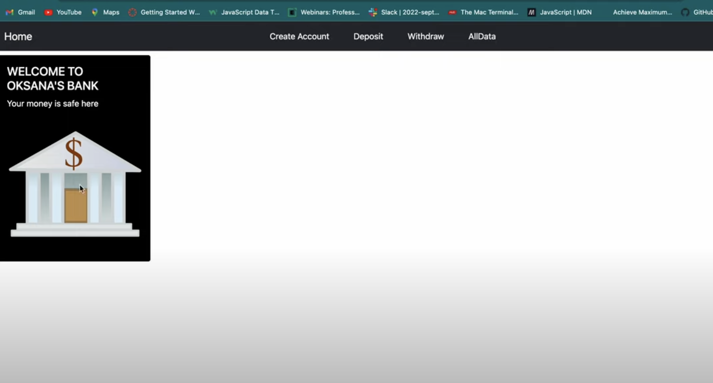

# Bank_App
# Project Title: Bank Application

# Description: 
The reasons why this project exists, including the answers to pertinent questions such as whom does it help, why did you build it, and what business or personal problem does it solve.

# Installation Guidelines: 
1. Clone the Repository: Open your terminal and navigate to the directory where you want to clone the repository. Use the following command to clone the repository:
git clone <repository_url>
Replace <repository_url> with the actual URL of the GitHub repository you want to clone. This will create a local copy of the repository on your machine.

2. Install Dependencies: Navigate into the cloned repository directory using the cd command. Once inside the project directory, run the following command to install the necessary dependencies: 
npm install
This command will use npm (Node Package Manager) to install all the required packages and dependencies specified in the package.json file.

3. Start the Development Server: After the dependencies are installed, you can start the development server by running the following command:
npm start
This command will start the development server, and you should see output indicating that the React app is running. It will also open a new browser tab or window with the app running locally at http://localhost:3000.

4. View and Interact with the App: Open a web browser and visit http://localhost:3000 to see the running React app. You can now interact with the app and explore its functionality.

Note: Make sure you have Node.js and npm installed on your machine before proceeding with the above steps. You can download and install Node.js from the official website (https://nodejs.org).

# Screenshots: 

# Technology used: React, MongoDB, Express, Bootstrap, NodeJS.

# Features: Work in progress.

## License Information
[MIT](https://choosealicense.com/licenses/mit/)

